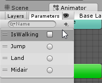
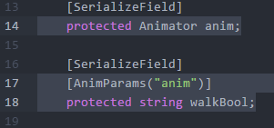
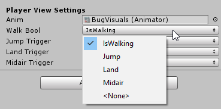

Animator Parameters Attribute
===

This attribute turns string properties into a popup of the parameters available inside an `Animator` in the inspector.

| Animator | Script | Inspector |
|---|---|---|
|  |  |  |

Usage
---

The component you want to use the attribute on must have an `Animator` exposed as a property/variable.

Use the `AnimParams` attribute on a `string` property/variable and the inspector will show a popup that lists all the parameter names available in the given `Animator`.

Pass the name of the `Animator` property as a string to the `AnimParams` attribute.

```C#
public class ExampleView : MonoBehaviour
{
	public Animator anim;

	// These are strings that we'll use to fire parameters in code
	// pass the name of the Animator variable/property as a string
	[AnimParams("anim")]
	public string paramIdleBool;

	[AnimParams("anim")]
	public string paramAttackTrigger;

	void Start()
	{
		// Use the property which will be filled with one of the
		// parameters names available in the animator in the inspector
		anim.SetBool(paramIdleBool, true);
	}
}
```

Advanced Usage
---

If you want the popup to refer to an Animator outside the scope of your script, you have to add a `AnimParamsConfig` variable to your MonoBehaviour. This will allow you to configure in the inspector which `AnimatorController` the dropdowns will refer to, to get the parameter names.

```C#
public class AnimParameterConsumer : MonoBehaviour
{
	public AnimParamsConfig paramConfig;

	// Note the `true` boolean after the name of the `AnimParamsConfig` property,
	// this tells the script to use the config when displaying the parameters
	[AnimParams("paramConfig", true)]
	public string paramIdle;

	[AnimParams("paramConfig", true)]
	public string paramAttack;
}
```

`AnimParamsConfig` does not retain a direct reference to the AnimatorController, instead it references it by the Unity instance ID which is not directly usable in runtime.
