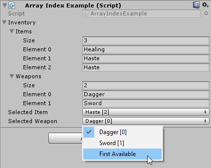

ArrayIndexAttribute
===

Turn an integer property into a drop down that references an array/list property. Useful for turning an property that is used as an index of the referenced array.



Usage
---

Parameter       | Value                                | Default
---             | ------------------------------------ | ---
Property Path   | Path to array this index references  | -
Default Index   | integer value to use as the default  | `-1`
Default display | String to display for the default    | `None`

```C#
public class ArrayIndexExample : MonoBehaviour
{
	[Serializable]
	public class UnitInventory
	{
		public string[] items;
		public string[] weapons;
	}

	public UnitInventory inventory;

  // property path references nested property
	[ArrayIndex("inventory.items")]
	public int selectedItem;

  // gives a default index of 0, with a custom display name
	[ArrayIndex("inventory.weapons", 0, "First Available")]
	public int selectedWeapon;
}
```
