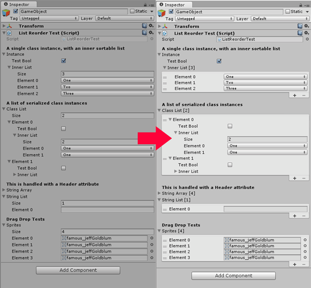

Sortable Array inspector
===

Automatically turn arrays/lists into ReorderableLists in Unity inspectors. Inspired by [Alejandro Santiago's implementation](https://medium.com/developers-writing/how-about-having-nice-arrays-and-lists-in-unity3d-by-default-e4fba13d1b50).



Usage
---

Place the SortableArrayAttribute folder in your project. By default, the inspector will only draw arrays marked with the `SortableArray` attribute

```C#
public class ListReorderTest : MonoBehaviour
{  
	[SortableArray]
	public string[] stringArray; // This will be drawn with a ReorderableList

	public List<string> stringList; // This will be drawn as a default array
}
```

If you want to apply the reorderable list to all arrays, edit `Editor\SortableArrayInspector.cs` and change `LIST_ALL_ARRAYS` to `true`

Additional Features
---

Handles arrays/lists nested inside other classes
```C#
public class ListReorderTest : MonoBehaviour
{
	[Serializable]
	public class InternalClass
	{
		public bool testBool;
		[SortableArray] public List<int> innerList;
	}

	[Header("A single class instance, with an inner sortable list")]
	public InternalClass instance;

	[SortableArray]
	[Header("A list of serialized class instances")]
	public List<InternalClass> classList;
}
```
Drag and drop objects into arrays like the default inspector


Limitations
---

- ReorderableLists of class instances may be a little rough, especially in Unity versions below 5.3
- Custom inspectors will not automatically gain the ability to turn arrays into reorderable lists. See next section for creating custom inspectors that allow for this functionality.

Custom inspectors
---

Custom inspectors will not be able to automatically draw arrays as ReorderableLists unless they inherit from `SortableArrayInspector`. The class contains helper functions that can handle the default property drawing. Below is a template for a custom inspector.

```C#
[CustomEditor(typeof(YourCustomClass))]
public class CustomSortableInspector : SortableArrayInspector
{
	// Called by OnEnable
	protected override void InitInspector()
	{
		base.InitInspector();

		// Do your own initializations here
	}

	public override void OnInspectorGUI()
	{
		// Not initialized, try initializing
		if (listIndex == null)
			InitInspector();

		if (hasSortableArrays && listIndex != null)
		{
			serializedObject.Update();

			// Call the relevant default drawer functions here
			/*
			// Draw all properties
			DrawDefaultSortable();

			// Like DrawPropertiesExcluding
			DrawSortableExcept("sprites");

			// Draw all properties, starting from specified property
			DrawPropertiesFrom("propertyName");

			// Draw all properties until a specified property
			DrawPropertiesUpTo("endPropertyName");

			// Draw properties starting from startProperty, ends at endProperty
			DrawPropertiesFromUpTo("startProperty", "endProperty");
			*/

			// Write your custom inspector functions here
			EditorGUILayout.HelpBox("This is a custom inspector", MessageType.Info);

			serializedObject.ApplyModifiedProperties();
			return;
		}

		DrawDefaultInspector(); // Fallback, just in case
	}
}
```
